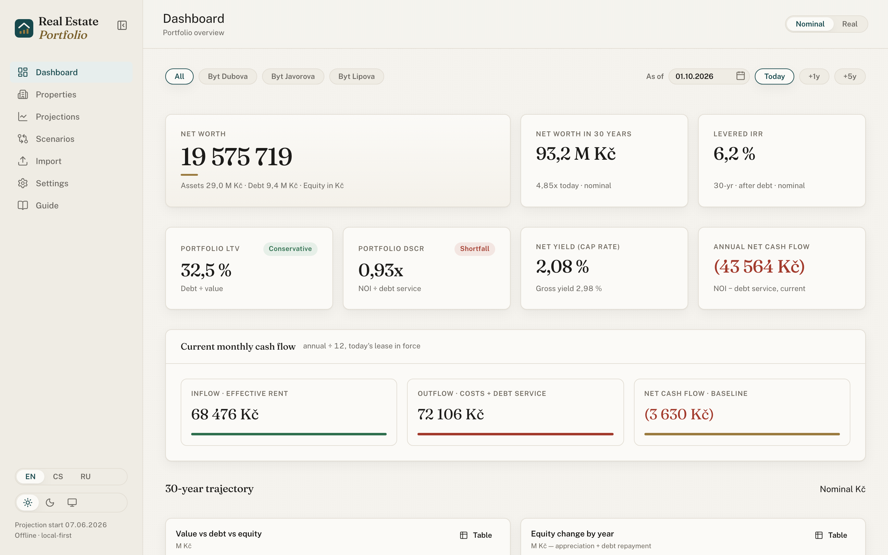
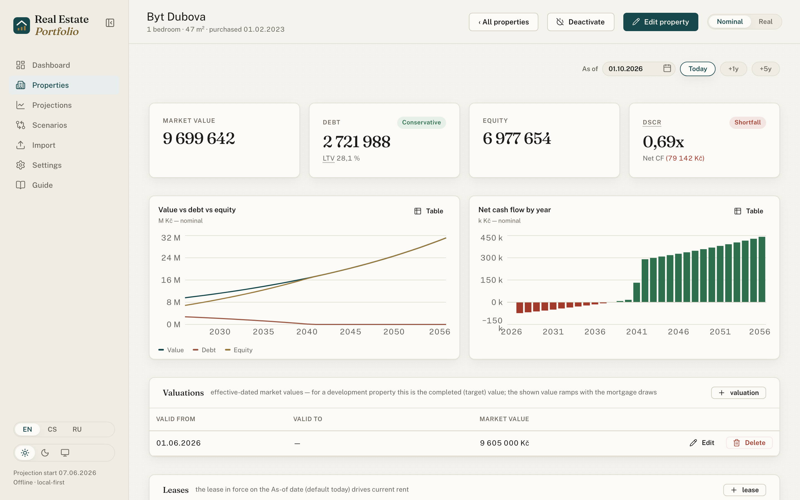
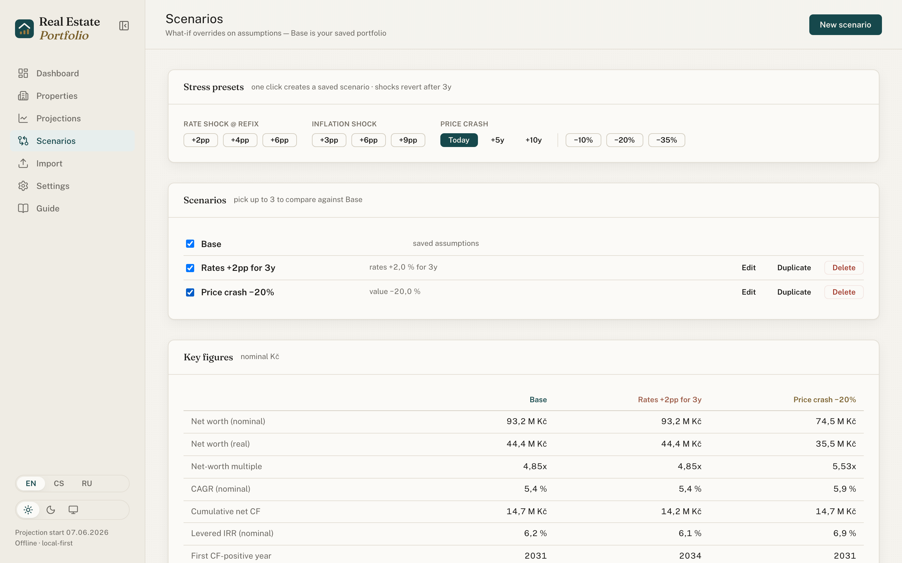
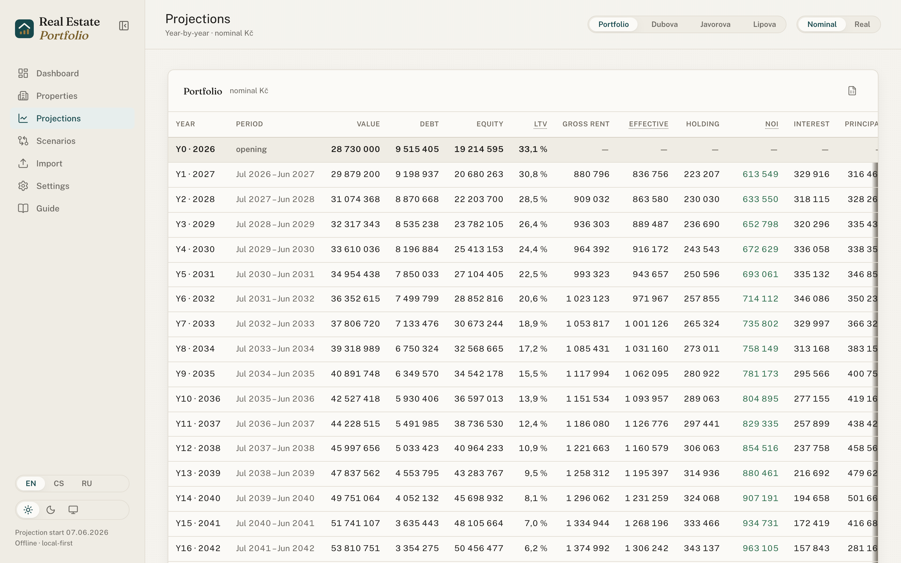
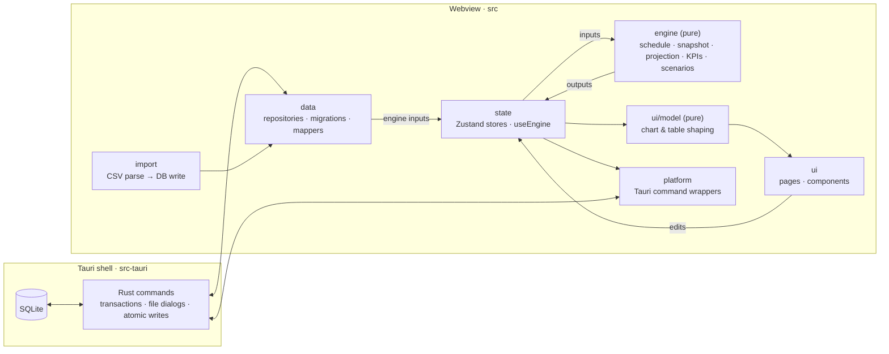

<div align="center">


# Real Estate Tracker

**A local-first macOS app for tracking a rental-apartment portfolio —<br>
mortgages, leases, valuations and costs — with 30-year projections, KPIs and what-if scenarios.**

[](https://github.com/vlastimilbures/real-estate-tracker/actions/workflows/ci.yml)
[](https://github.com/vlastimilbures/real-estate-tracker/releases)
[](LICENSE)


[Features](#features) · [Screenshots](#screenshots) · [Install](#install) ·
[Build from source](#build-from-source) · [Architecture](#architecture) ·
[Documentation](#documentation)

</div>

<br>

<picture>
  <source media="(prefers-color-scheme: dark)" srcset="docs/screenshots/dashboard-dark.png">
  
</picture>

<sub>All figures in the screenshots come from the built-in fictional sample portfolio.</sub>

## Why

Spreadsheets are a fine start for a few rental flats, but they get fragile once loans have
fixation periods, rents change mid-year and you want to ask "what if rates jump 2 points at the
next refix?". Real Estate Tracker is a desktop app with a **pure, tested financial engine**: it
amortizes Czech annuity mortgages month by month, follows leases and valuations by date, and
projects value, rent, cash flow and net worth for 30 years in **nominal and real** terms.
Everything runs and stays on your Mac.

## Features

**Portfolio & mortgages**

- 1…N properties, each with effective-dated valuations, leases and holding costs
- Czech annuity loans with **fixation and rate reset** on the loan's own due dates
- Refinancing by successor blocks, **development loans** (tranche draws, interest-only
  period), future-dated purchases with partial-year pro-rating
- Optional contract maturity date: the loan panel warns when the instalment implies a
  different maturity or a fixation ended without a follow-on block

**Analysis**

- **30-year projections** of value, debt, equity, rent, NOI and cash flow — nominal or real
  (cumulative CPI index, so inflation shocks deflate correctly)
- KPIs: LTV, DSCR, gross/net yield, net-worth multiple and CAGR, **levered IRR**,
  first cash-flow-positive year, debt-free year
- **As-of lens** — view the portfolio on any date in the projection window
- **Scenarios** — named assumption overrides, temporary rate and inflation shocks, value
  haircuts, one-click stress presets and side-by-side comparison

**Data**

- **CSV import** for properties, valuations, leases and mortgages — all-or-nothing, with
  per-row, per-column messages
- **JSON backup & restore** with validation and an automatic safety backup
- **Excel export** of projection and amortization tables

**App**

- English, Czech and Russian UI; Czech number, date and currency formatting
- Light, dark and system themes; keyboard navigation and macOS menu shortcuts
- Accessibility checked with axe (WCAG 2.2 AA) on every screen in CI

## Screenshots

<table>
  <tr>
    <td width="50%">
      <picture>
        <source media="(prefers-color-scheme: dark)" srcset="docs/screenshots/property-detail-dark.png">
        
      </picture>
      <p align="center"><b>Property detail</b> — value, debt and cash flow over time</p>
    </td>
    <td width="50%">
      <picture>
        <source media="(prefers-color-scheme: dark)" srcset="docs/screenshots/scenarios-dark.png">
        
      </picture>
      <p align="center"><b>Scenarios</b> — stress presets compared with Base</p>
    </td>
  </tr>
  <tr>
    <td colspan="2">
      <picture>
        <source media="(prefers-color-scheme: dark)" srcset="docs/screenshots/projections-dark.png">
        
      </picture>
      <p align="center"><b>Projections</b> — year-by-year grid for the portfolio or a single property</p>
    </td>
  </tr>
</table>

## Install

Download the latest `.dmg` from [Releases](https://github.com/vlastimilbures/real-estate-tracker/releases)
(Apple Silicon, macOS 13 or later) and drag the app to Applications.

The app is ad-hoc signed, not notarized, so macOS blocks the first launch:

- **macOS 15+:** open the app once, then **System Settings → Privacy & Security → Open Anyway**.
- **macOS 13–14:** Control-click the app in Finder → **Open** → **Open**.

On first launch the app seeds a fictional sample portfolio so every screen has data; delete it
or import your own via CSV. Your data lives in
`~/Library/Application Support/com.bures.realestate-tracker/` — see
[Privacy & security](#privacy--security).

## Current limits

The app is a planning tool, and its figures are estimates. Returns are measured from the
projection start, not from your purchase. It does not model income or capital-gains tax,
selling costs, early repayments or a bank-account ledger. Amounts are in Kč only.
[Model assumptions & limitations](docs/model-limitations.md) lists everything the model
simplifies or leaves out.

## Build from source

| Requirement              | Version                                                         |
| ------------------------ | --------------------------------------------------------------- |
| macOS                    | 13 or later, Apple Silicon                                      |
| Xcode Command Line Tools | `xcode-select --install`                                        |
| Rust                     | via [rustup](https://rustup.rs) — `rust-toolchain.toml` pins it |
| Node.js                  | ≥ 24                                                            |
| pnpm                     | ≥ 11.5 (`corepack enable` picks up the pinned version)          |

```bash
pnpm install                 # dependencies + git hooks
pnpm tauri dev               # run the app with hot reload
scripts/release-macos.sh     # build, ad-hoc sign and verify a release bundle
```

> [!TIP]
> `pnpm tauri dev` opens your real database. To work on the UI without touching it, run
> `pnpm ux:capture` — it renders every screen in a browser on an in-memory copy of the sample
> portfolio.

## Architecture



- **The engine is pure** — typed inputs in, typed outputs out; no IO and no clock reads
  (the base date is always a parameter). It may import only `decimal.js` and the money helpers.
- **Money is never a float** — `decimal.js` everywhere, stored as decimal text in SQLite and
  rounded only for display.
- **One-way data flow** — DB → mappers → engine → UI. Components never do financial arithmetic.
- **Enforced by tooling** — dependency-cruiser checks the layer map and import cycles; ESLint
  bans clocks, randomness and float parsing inside the engine.

### Project layout

| Path                                            | What lives there                                                                                |
| ----------------------------------------------- | ----------------------------------------------------------------------------------------------- |
| [`src/engine/`](src/engine)                     | Pure financial engine: amortization, snapshot, projections, KPIs, scenarios, validation         |
| [`src/engine/__tests__/`](src/engine/__tests__) | Parity, invariant, property-based and golden-master tests; independent mortgage reference model |
| [`src/data/`](src/data)                         | SQLite repositories, migrations, runtime guards, mappers, seed, backup                          |
| [`src/import/`](src/import)                     | CSV importer — pure parse/validate plus the DB write                                            |
| [`src/state/`](src/state)                       | Zustand stores, memoised engine recompute, facades the UI uses                                  |
| [`src/ui/`](src/ui)                             | Pages, components and pure view models (`ui/model`)                                             |
| [`src/i18n/`](src/i18n)                         | Typed English, Czech and Russian dictionaries                                                   |
| [`src/lib/`](src/lib)                           | Decimal money maths (PMT/FV/NPER) and display formatting                                        |
| [`src/platform/`](src/platform)                 | Wrappers around the app's Tauri commands                                                        |
| [`src-tauri/`](src-tauri)                       | Rust shell: DB transactions, file dialogs, atomic writes, menu, navigation guard                |
| [`ux-capture/`](ux-capture)                     | Screenshot + axe harness for every screen                                                       |
| [`docs/`](docs)                                 | Architecture decision records, release guide, design notes, roadmap                             |

## Quality

Every check CI runs has a local command; the full list is in [CONTRIBUTING.md](CONTRIBUTING.md#checks).

| Command                        | Checks                                                                   |
| ------------------------------ | ------------------------------------------------------------------------ |
| `pnpm typecheck` · `pnpm lint` | TypeScript strict; ESLint with zero warnings, incl. engine-purity rules  |
| `pnpm test:coverage`           | ~1,500 Vitest tests with per-folder coverage floors                      |
| `pnpm test:parity`             | Engine and SQLite round trip against the parity targets (±1 Kč, ±0.0001) |
| `pnpm depcruise` · `pnpm knip` | Layer map and cycles; unused files, exports and dependencies             |
| `cargo clippy` · `cargo test`  | Rust lints and integration tests                                         |
| `pnpm ux:axe-check ci`         | axe scan of every screen, light and dark                                 |
| `pnpm mutation` · `pnpm bench` | Nightly: Stryker mutation score on the engine; performance budgets       |

## Privacy & security

- **Offline by design** — no network calls, analytics or updater. A strict Content Security
  Policy and a navigation guard keep the webview on the app.
- **Least privilege** — the webview can use the SQL plugin, menu events and the app's own
  commands, nothing else. File dialogs and writes run in Rust; the webview never sees a path.
- **Your data stays on your Mac:**

  | What                           | Location                                                              |
  | ------------------------------ | --------------------------------------------------------------------- |
  | Database                       | `~/Library/Application Support/com.bures.realestate-tracker/`         |
  | Automatic backups              | `~/Library/Application Support/com.bures.realestate-tracker/backups/` |
  | Error log (rotating, 5 × 1 MB) | `~/Library/Logs/com.bures.realestate-tracker/app.log`                 |

  Files are readable only by your user (`0600`); they are not encrypted beyond FileVault.

Found a vulnerability? Please report it privately — see [SECURITY.md](SECURITY.md).

## Documentation

| Document                                               | Contents                                                          |
| ------------------------------------------------------ | ----------------------------------------------------------------- |
| [SPEC.md](SPEC.md)                                     | Product and engine specification: domain model, formulas, screens |
| [docs/adr/](docs/adr/README.md)                        | Architecture decision records                                     |
| [docs/model-limitations.md](docs/model-limitations.md) | What the figures mean and what the model leaves out               |
| [docs/roadmap.md](docs/roadmap.md)                     | Planned work and engineering backlog                              |
| [docs/release.md](docs/release.md)                     | Building, signing, Gatekeeper, data locations                     |
| [CONTRIBUTING.md](CONTRIBUTING.md)                     | Setup, checks, commit style, decision process                     |
| [CHANGELOG.md](CHANGELOG.md)                           | User-visible changes per release                                  |
| [CLAUDE.md](CLAUDE.md)                                 | Engineering rules, also used for AI-assisted work                 |

## License

[MIT](LICENSE) © 2026 Vlastimil Bureš
